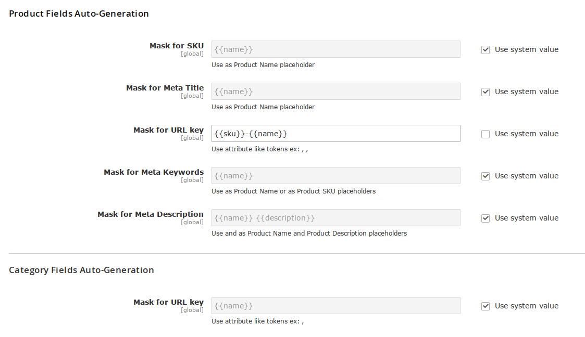

# UrlKeyMask
This module's goal is to enable the use of mask in the generation of URL keys for both products and categories. The default Magento behavior is to only use the name. Using this module, you can now use entity attributes as tokens.

## Settings

The settings can be changed under Stores Settings, Catalog > Catalog. For products, the field URL Key Mask is available under  the Product Fields Auto-Generation option group. For categories, the field URL Key Mask is available under Category Fields Auto-Generation option group.

## TODO
It is obvious this behavior should have been included out of the box inside Magento 2. I will try to have this module change's integrated as a feature submission into the core as soon as it reach a maturity level I'm happy with.

## Changelog
See [CHANGELOG.md](CHANGELOG.md)

## License
This software falls under OSL V3.0, see [LICENSE.txt](LICENSE.txt)